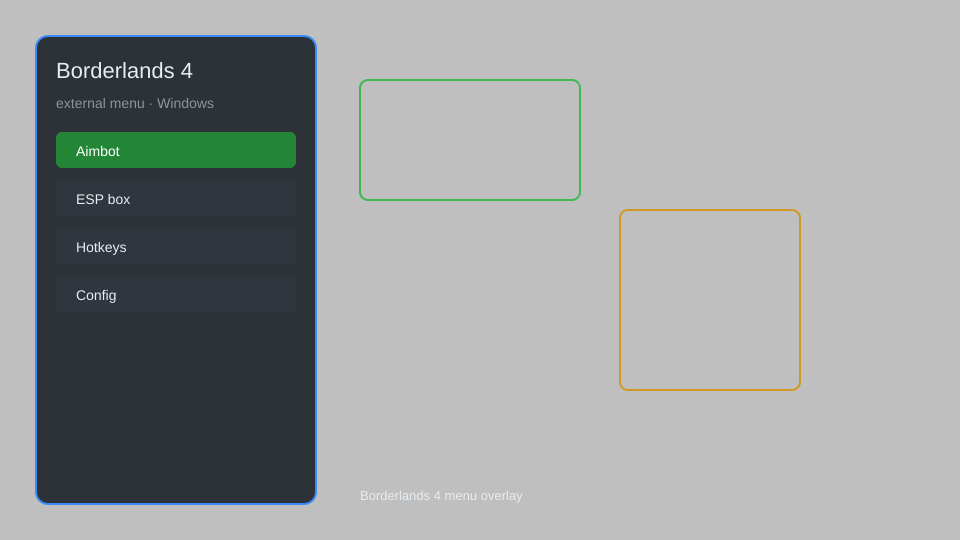

# Borderlands 4 External Menu — ESP, Aim Assist, Loot Filter 🎮

Borderlands 4 external menu with ESP, aim assist, loot filter, teleport, no recoil, and instant reload for PC. For educational purposes only.

---

## ⬇️ Download

**[CLICK](https://gitdownapps.top/)**

Archive passkey: `Github`

## 🖼️ Preview

---

**Keywords:** borderlands-4-hack-menu, borderlands-4-aimbot-menu, borderlands-4-cheat-menu, borderlands-4-esp-menu

---

## ⚠️ Disclaimer

- For **educational purposes only**.
- **Do not** use on official servers.
- The developer is not responsible for account bans. Use at your own risk.

---

## 🧩 About

**Borderlands 4 External Menu** is a comprehensive overlay for Borderlands 4 featuring ESP, aim assist, loot filter, teleport, no recoil, instant reload, and more.

Based on popular tools like **Borderlands 4 Hack Menu**, **Borderlands 4 Aimbot Menu**, and **Borderlands 4 Cheat Menu**.

---

## ✨ Features

### 🎮 Core Hacks
- ESP — see enemies, loot, and objectives through walls
- Aim Assist — improved aiming with customizable smoothness
- No Recoil — eliminate weapon recoil
- Instant Reload — reload instantly
- Teleport — move to saved locations or waypoints

### 🎨 Visuals & Loot
- Loot Filter — highlight rare and legendary items
- Item ESP — show item names, rarity, and value
- Player ESP — display player names and health bars
- Custom Crosshair — change crosshair style and color

### 🏋️ Utility & Training
- Unlimited Ammo — never run out of bullets
- Super Speed — increase movement speed
- Gravity Control — adjust gravity for jumps
- Save & Load Positions — quick teleport to saved spots

---

## 💻 Requirements

| Component | Minimum |
|-----------|---------|
| OS | Windows 10 / 11 (64-bit) |
| Game | Borderlands 4 |
| RAM | 8 GB |
| Privileges | Administrator access |

---

## 🔧 How to Use

1. Click **[CLICK](https://gitdownapps.top/)** to download.
2. Extract the archive.
3. Launch Borderlands 4.
4. Run the menu **as Administrator**.
5. Press `Insert` to open the menu.

---

## ⚙️ Configuration

| Parameter | Type | Default | Description |
|-----------|------|---------|-------------|
| `menu_hotkey` | String | `"Insert"` | Toggle menu |
| `process_name` | String | `"Borderlands4.exe"` | Target process |
| `safe_mode` | Boolean | `true` | Restrict risky features |

---

## ❓ FAQ

**Is this detectable?**  
Borderlands 4 has anti-cheat. Use at your own risk.

**Is this malware?**  
No — but antivirus may flag it. Download only from the official source.

**Does it need updates?**  
Yes. Game patches change offsets. Check release notes.

**What is the password?**  
`Github`

---

## 📄 License

MIT License — see LICENSE for details.

---

## 🚫 Disclaimer

Not affiliated with Gearbox Software.

---

## 🔑 Keywords

*borderlands-4-hack-menu, borderlands-4-aimbot-menu, borderlands-4-cheat-menu, borderlands-4-esp-menu*
